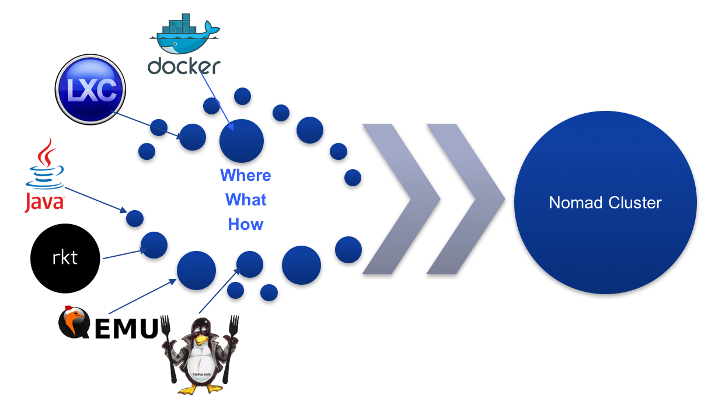

# Nomad简介
## 前言
话说在容器编排领域，可谓是竞争异常激烈，无论实在编排工具本身功能，还是社区生态，对手之间各自都使出自己的杀手锏使自己能在该领域有一席之地，更有甚者希望自己能有一统天下之势。但实际依然百家争鸣，各领风骚。当前，开源容器编排主要是以Google的Kubernetes, Mesosphere的基于Apache Mesos和Marathon和Docker自己的Docker Swarm三家形成三足鼎立之势，其中社区不乏有称Kubernetes最具大哥风范，引领另外两家，掌握发展风向。但除了这三家之外，还有一集群资源管理及任务调度工具: Nomad，相信大家熟悉Consul, Vagrant或者Terraform，不错，Nomad跟Consul, Vagrant及Terraform来自同一家公司: Hashicorp，该公司开源了一些十分优秀的个人开发及企业应用软件。同样，Nomad也是一款非常优秀，经过长期验证的集群资源管理及任务调度工具，虽不及Kubernetes, Mesos，Swarm那样名声在外，但在容器及任务编排领域也有举足轻重之地位，受到一些大企业的另眼相看并应用生产环境。至于跟Kubernetes, Mesos及Swarm之间的比较，大家可以参考Nomad官方[比较](scrollPreviewWithEditorSelection), 社区也有一些他们之间的详细[比较](https://github.com/KaivoAnastetiks/container-orchestration-comparison/blob/master/README.md)。接下来我们将介绍一些Nomad的特性及其架构:

## Nomad是什么
Nomad是一分布式的，高可用的，从一开始就是为微服务而设计，同时支持批处理工作负载的集群资源管理及任务调度工具，企业使用Nomad可以很容易方便地将应用，无论是基于容器(Docker, rkt, LXC)还是原生二进制应用包，甚至是VM部署到成千上万的计算节点。同时，Nomad还支持多区域(Multipule Regions)和多数据中心(Multipule Datacenters)，企业根据应用特性以及其本身商业运营策略将应用部署到不同的区域和数据中心，享受多区域多数据中心带来的高可用性，高稳定性。

## Nomad特性
作为一个资源及任务调度工具，其本身具有很多特性，如：

* 易用性
* 独立于任何平台
* 简化企业运维
* 提高资源利用率，减低企业成本

### 易用性
对于易用性，我们首先来说如何部署Nomad运行环境。不像Mesos, Kubernetes会为不同类型的服务安装不同的安装包，而且还有一些额外的依赖，而安装Nomad只需一个安装包，没有任何额外依赖，无论是Nomad Server端还是Nomad Agent端，除配置外其他都完全一样。这使得部署Nomad运行环境非常简单。

除此之外，Nomad部署及管理工作也非常简单易用，没有复杂繁琐的配置，我们看下图如何描述Nomad的大致工作流程：

